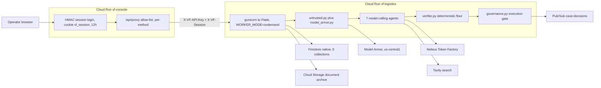
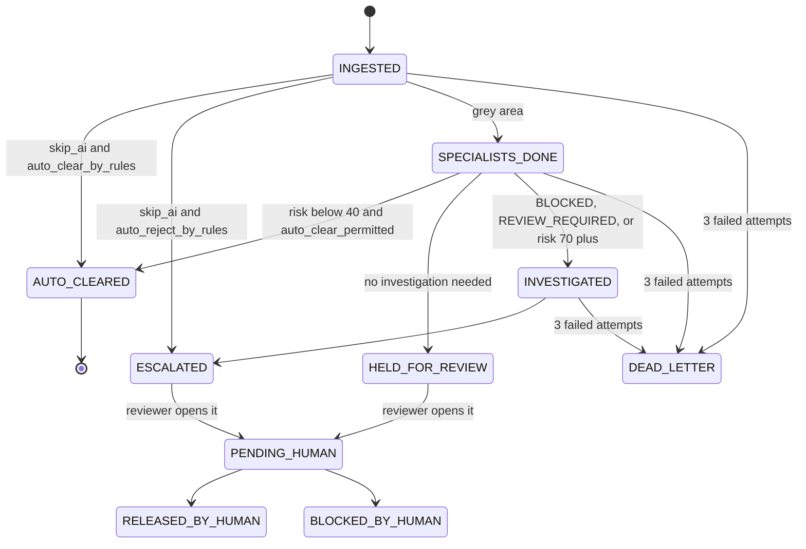
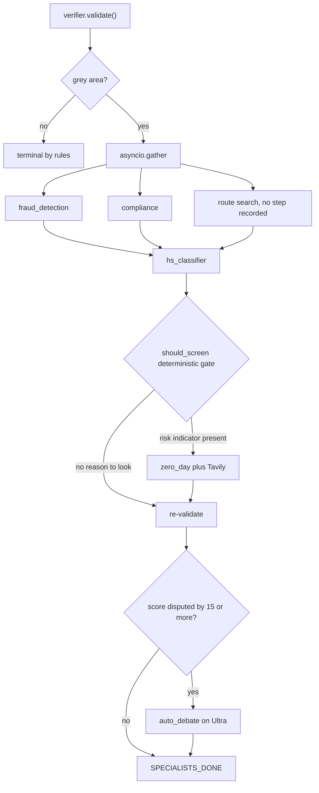

# Architecture

VF Logistics screens freight shipments for fraud and sanctions exposure, and acts on
what it finds without asking a human per shipment. It runs on Google Cloud for
infrastructure and on Nebius Token Factory for inference. No Google AI model is used
anywhere; `requirements.txt` carries only `google-cloud-firestore`,
`google-cloud-pubsub` and `google-cloud-storage`.

This document is written from the code, not from the docstrings. Where a docstring
disagrees with the code it describes, the code wins and the disagreement is noted.

---

## The load-bearing idea

Three different questions, answered by three different mechanisms, deliberately kept
apart:

| Question | Answered by | Can it lower risk? |
| --- | --- | --- |
| What is *true* about this shipment? | agents, on Nemotron | no |
| What is *proven*? | `verifier.py`, arithmetic and list lookups only | it sets the floor |
| What may be *done* about it? | the published delegation boundary | it refuses, never invents |

An agent finding is a claim until something deterministic agrees with it. Authority is
granted by publication, not earned by reasoning well.

---

## Deployment topology



Region is `asia-southeast1` throughout, except Model Armor which is configured at
`us-central1`.

### Why the console has its own login and not Cloud IAP

IAP was the first choice and is not available on this project. It needs an OAuth
consent screen, and creating one requires the Google Cloud project to belong to an
organisation -- `gcloud iap oauth-brands list` answers *"Project must belong to an
organization"*. The older brand API that could have worked around it was shut down in
March 2026.

Setting `iapEnabled` on the Cloud Run service without a consent screen does not fail
loudly. It serves an empty HTTP 502 to every visitor. That is how this was discovered,
and it is why `frontend/src/lib/session.ts` exists.

So the console signs its own sessions with HMAC over `VF_SESSION_SECRET`. That is a
smaller trust base than IAP -- our HMAC rather than Google's -- and the tradeoff is
accepted deliberately, because the alternative on this project is no login at all.

### What the login replaced

Before it, every visitor to the deployed console was a `GOVERNANCE_ADMIN`. The proxy
attaches `VF_API_KEY` server-side to every forwarded request, a valid key grants
`GOVERNANCE_ADMIN` upstream, and there was nothing in front of it. Measured against
the live service with no credential of any kind:

```
GET https://vf-console-.../api/proxy/billing/usage   -> 200   data returned
GET https://vf-logistics-.../api/v1/billing/usage    -> 403   backend refuses
```

The backend authorisation was right. The console defeated it.

**Writes are now closed and reads are deliberately still open.** `POST` and `PUT` on
the proxy refuse without a verified session -- measured, an anonymous
`POST /api/proxy/governance/simulate` returns 401. `GET` is governed separately by
`VF_PUBLIC_READS`, which is **on** in this deployment:

```
POST /api/proxy/governance/simulate   -> 401   writes need a session
GET  /api/proxy/billing/usage         -> 200   reads are public by configuration
```

That split is the same line the backend draws in `anonymous_role()`: reads are public,
writes need a credential. `VF_PUBLIC_READS` defaults to false, and the default is the
point -- a deployment that forgets it is locked, not open. It is on here for a stated
reason, the judging window, and one consequence is accepted knowingly: an anonymous
GET still carries `VF_API_KEY` upstream, so an anonymous reader sees `review/queue` and
`billing/usage`, both of which sit above `viewer` on the backend.

**This must be turned off before a paying customer's data is in the store.**

---

## How a case enters

Six ways, all `@require_operator`:

| Route | Mechanism |
| --- | --- |
| `POST /api/v1/events/shipment` | bare JSON or a Pub/Sub push envelope, auto-detected |
| `POST /api/v1/events/document` | multipart upload, PDF/PNG/JPG/WEBP, 20 MB cap |
| `POST /api/v1/events/storage` | Pub/Sub push from a GCS object-finalize notification |
| `POST /api/v1/ingest/bucket-sweep` | batch sweep of already-staged objects, 25 max |
| `POST /api/v1/simulate`, `/simulate/bulk` | synthetic injection |
| `POST /api/v1/compliance/audit` | the B2B contract surface, idempotent on `client_reference` |

Two things a reader usually gets wrong:

**Pub/Sub push arrives over authenticated HTTP, not a subscriber client.** The
subscription must send `X-VF-API-Key` or deliveries 403. `/events/storage` always
returns 200 even on error, to stop redelivery, and logs instead.

**Six more routes call agents without creating a case at all** --
`/fraud/analyze`, `/fraud/batch`, `/compliance/screen`, `/compliance/entity`,
`/investigation/case`, `/investigation/report`. They spend tokens and never reach
`steps[]`, so they are invisible to both the cost panel and `sum_rollups`.

### Idempotency

`ingest_shipment` returns the existing case for a repeated `shipment_id`. Storage
objects get a `CASE-DOCOBJ-{sha1}` marker case. `compliance_audit` checks
`find_case_by_client_reference` *before any work*, not after.

---

## The agent layer

Seven agents call a model. All live in `src/vf_logistics/agents/`.

| Step identifier | Module | Model | Decides |
| --- | --- | --- | --- |
| `document_intake` | `document_agent.py` | MiniCPM-V | transcribes a PDF into a shipment record; a transcriber, not a scorer |
| `fraud_detection` | `fraud_detection_agent.py` | Nano | `risk_score` 0-100 and flags |
| `compliance` | `compliance_agent.py` | Nano | CLEARED / REVIEW_REQUIRED / BLOCKED |
| `hs_classifier` | `hs_classifier_agent.py` | Nano | whether cargo description matches the declared HS heading |
| `zero_day` | `zero_day_agent.py` | Nano | adverse media on counterparties absent from the sanctions list |
| `auto_debate` | `debate_agent.py` | Ultra | CONFIRM or DISAGREE with Nano, with an adjusted score |
| `investigation` | `investigation_agent.py` | Super | fraud pattern, exposure estimate, escalation narrative |

Three further identifiers appear in the same "Cost by agent" panel and are **not**
model calls:

- `sql_prefilter` -- deterministic, recorded with `model: None` and zero tokens *by
  construction*. A reader of that panel would otherwise assume every row cost money.
- `model_armor` -- the blocked-document path.
- `debate` -- manual Deep Review. Same module and model as `auto_debate`, under a
  second name, so one agent occupies two rows.

The panel is data-driven, not a hardcoded list: it reads `tokens_by_agent`, which the
orchestrator builds by keying on `step["agent"]`.

### Tool use

Four agents reach outside, all via Tavily. `compliance` searches on every shipment.
`investigation` searches conditionally. `zero_day` and `auto_debate` use model-driven
function calling.

`zero_day`'s spending is gated by `should_screen()`, which is **code, not the model**:
*a model deciding when to spend money is a model whose cost is unbounded by anything
except its own judgement.* `auto_debate`'s tool use is not gated the same way.

One more search runs with no step recorded at all: the lane-disruption lookup inside
the `INGESTED` transition. Its result lands on the case but never in the cost panel.

---

## Models and cost

`config.PRICING`, in USD per 1,000,000 tokens:

| Model id | Input | Output | Used for |
| --- | --- | --- | --- |
| `nvidia/NVIDIA-Nemotron-3-Nano-30B-A3B` | 0.06 | 0.24 | fraud, compliance, HS, zero-day |
| `nvidia/nemotron-3-super-120b-a12b` | 0.30 | 0.90 | investigation |
| `nvidia/Nemotron-3-Ultra-550b-a55b` | 1.00 | 3.00 | auto_debate and manual Deep Review, by default |
| `openbmb/MiniCPM-V-4_5` | 0.658 | 1.11 | document intake |

Transport is `openai.AsyncOpenAI` against Token Factory. 45 s per request, a 90 s total
retry budget, 3 attempts, and `max_retries=0` on the SDK so there is one retry policy
rather than two.

**`pricing_for()` falls back to Nano for an unrecognised id, and logs at ERROR.** The
fallback direction is deliberate: Nano is the cheapest entry, so an unpriced model
under-reports spend rather than over-reporting it. That protects the customer's invoice
and endangers the operator's budget, because the spend ceiling reads the same figures.
This is reachable in production: `set_model()` refuses anything absent from `PRICING`,
but `NEMOTRON_MODEL` is read from the environment with no such check.

`set_model()` moves less than its name implies. It rebinds only the text model, so
`POST /api/v1/config/model` cannot move investigation, debate, or document intake --
those are pinned at import or have no setter.

---

## The pipeline



Any transition whose proposed action the boundary refuses lands in `PENDING_HUMAN`
instead of its intended state.

### Inside the INGESTED transition, the specialists run in parallel



**The module docstring of `orchestrator.py` contradicts this.** It draws
`FRAUD_SCORED` and `COMPLIANCE_SCREENED` as sequential states. Neither string exists
anywhere else in the codebase. Any diagram drawn from that docstring inherits the
error; the previous `architecture.html` did.

### Two naming traps in the state set

`TERMINAL` has seven members but is a misnomer its own comment admits: three of them
(`HELD_FOR_REVIEW`, `ESCALATED`, `PENDING_HUMAN`) are queued on a human, not closed.
"The agent is done" and "the case is closed" are different facts.

`OBJECT_PROCESSED` is a storage dedupe marker that appears in neither `ACTIONABLE` nor
`TERMINAL`, so it is never claimed, and `is_marker: True` keeps it out of the board and
the metrics.

Thresholds: clear below 40, investigate at 70, 3 attempts, 3 concurrent, 6 chain steps,
120 s chain budget.

---

## The deterministic layer

`verifier.py` consults no model and performs no network I/O. The governing rule, quoted:

> An agent may RAISE risk. It may never LOWER risk below the deterministic floor.

Because *the cost of a wrong exoneration is released contraband and the cost of a wrong
escalation is a human spending ten minutes on a clean shipment.* Those two errors are
not worth the same, so the mechanism is not symmetric.

Three things a reader should not have to infer:

1. **`auto_clear_permitted` is `floor == 0`, not `floor <= threshold`.** A single
   MEDIUM finding anywhere blocks auto-clear entirely, however low the model scored.
2. **A missing model score floors at 50, not 0.** A model outage routes to a human and
   can never release.
3. **The asymmetry is asserted at runtime, not merely documented.** `validate()`
   computes the floor twice, with and without model-derived findings, and raises if a
   model ever lowered it.

Corroboration is explicit: two HIGH findings floor at 80, three or more at 90. Several
independent mid-severity facts together are worse than any one alone.

Model-derived findings can only add. A "consistent" HS verdict returns no finding at
all rather than a clearing one, and so does "no risk found" from zero-day. Their floors
sit deliberately *below* lookup-derived ones -- a dual-use HS code found by dictionary
lookup floors at 85, the semantic mismatch at 80.

One caveat the module header does not carry: `validate()` triggers a sanctions index
read on the first call in a container's life, so "no I/O" is true only afterwards.

---

## Delegated authority

`governance.py` gates six protected actions:

```
release_shipment   hold_shipment   assign_analyst
draft_sar          notify_webhook  publish_decision
```

- **No active boundary means suspended.** Every protected action is refused; analysis
  keeps running and can only propose.
- **A denial converts the whole outcome into a proposal.** State becomes
  `PENDING_HUMAN`, `decision` becomes `None`, and the loop *breaks* on the first
  denial rather than continuing. It has to: `publish_decision` runs last, and letting
  the loop continue once announced `outcome: AUTO_CLEARED` on the decisions topic for
  a shipment the boundary had just refused to release.
- **Two triggers no boundary can waive:** `injection_detected` and
  `forbidden_field_attempted`.
- **`draft_sar` is `may_draft` and never `may_file`.** The tool sets
  `requires_human_signoff: True`.
- **A human decision bypasses the gate deliberately** -- a boundary constrains what
  the agent may do on its own, and the reviewer is the authority the boundary derives
  from. What a reviewer cannot do is act anonymously: a name is required, and a note is
  required for anything but a plain release.

Boundaries are versioned, published by a named human as machine-readable JSON, and the
version in force is stamped on every executed action, so a past decision replays
against the policy of its time.

---

## Persistence

Five Firestore collections:

```
cases   events   audit_log   delegation_boundaries   prefilter_rules
```

The docstring at the top of `store.py` lists only the first three.
`prefilter_rules` is keyed *by tenant id as the document id*, deliberately, so a tenant
cannot end up with two live rule sets.

### Tenancy

Every document carries `_tenant_id`. Three enforcement properties:

- **Ownership is sticky.** An existing case keeps its stored owner; a write from
  another tenant's context raises rather than re-homing the record, and on Firestore
  the check runs *inside* the transaction.
- **A foreign read returns `None`, not 403.** A distinct response would confirm the id
  is real and permit enumeration.
- **`_scoped()` keeps the filter in one place** so a new query cannot be written
  without one.

The case id namespace is global, not per-tenant, so two tenants cannot share a
`case_id`. Integrator-supplied `client_reference`, the genuinely collision-prone key,
*is* scoped per tenant.

### Composite indexes are not optional

`infra/firestore.indexes.json` defines 27 composite indexes -- 20 on `cases`, 4 on
`audit_log`, 2 on `delegation_boundaries`, 1 on `events`. Every one leads with
`_tenant_id`, because Firestore requires equality-filtered fields to precede the
ordered field, and an index without it is one Firestore refuses to use. The query then
fails outright rather than running unscoped, which is the right failure.

Most of the `cases` indexes exist for `sum_rollups` alone, and that count is why they
are generated by `infra/monitoring/create_billing_indexes.py` rather than written by
hand: there are two document shapes times eight summable fields. Their absence was not
a slow
query: it was `FAILED_PRECONDITION` on the aggregation that `orchestrator.snapshot()`
calls, so both `/api/v1/orchestrator/state` and `/api/v1/billing/usage` returned 500
and the operations board went blank. The windowed variants carrying
`created_at` are needed only once a billing period is requested -- so a deployment
missing those keeps serving the dashboard and fails on the first invoice.

### Durability

Point-in-time recovery is enabled with a 7-day window, delete protection is on, and
there are two backup schedules: daily with 7-day retention, weekly with 14-week
retention. PITR protects forward from when it was enabled, not retroactively.

### The document archive

Bucket `vf-fraud-detection-phuochoa-documents`, path
`shipping-documents/YYYY/MM/DD/{case_id}/{filename}`. `DOCUMENT_BUCKET` has **no
default**: unset means archiving is silently skipped and ingestion still proceeds,
because losing the archive should not lose the shipment.

**Two kinds of object are archived, not one.** Uploaded originals, and *synthesised*
bills of lading for cases that arrived as JSON -- every case must be reviewable against
paperwork, so a rendered PDF is archived alongside, flagged `"generated": True` so a
reviewer is never shown a reconstruction as an original.

The `shipping-documents/` prefix is also the loop-breaker: both the storage sweep and
the Pub/Sub storage handler skip it, or the pipeline would process its own output.

---

## Concurrency and failure

**There is no background loop by default.** `WORKER_MODE=ondemand` means the pipeline
is driven by request handlers -- the Pub/Sub push handler advances a case to terminal,
and polling `/api/v1/orchestrator/state` drains one case. Cloud Run freezes the
container once a response is sent, so a real loop would need
`--no-cpu-throttling --min-instances=1`.

**A claim is a lease, not a lock.** 180 s by default; a case whose holder died is
re-offered rather than stranded.

**Retries back off 5 s, 10 s, 20 s**, then `DEAD_LETTER` on the third failure.

**Optimistic locking.** `_version` is store-managed and incremented on every write.
Every `put_case` on an existing case passes `expected_version`, including both writes
in the failure path.

`_superseded()` handles the case where somebody else committed while a transition was
running. Its defining property is that it **writes nothing** -- the in-memory copy is a
mutated stale snapshot, and persisting it is exactly the bug it exists to prevent. A
reviewer released a case at 07:27:18 and it read `ESCALATED` again twenty seconds later
because a losing transition wrote its stale copy back. It also does not increment
`attempts`: a lost race is not a fault, and counting it would let three quick reviewer
decisions dead-letter a healthy case.

**A lock guards writes only.** `advance_until_terminal` therefore re-reads the stored
case before every step after the first -- by the time `OptimisticLockError` fires,
`hold_shipment` and `draft_sar` have already executed against a shipment a human had
released. Stopping the write is not stopping the side effects.

---

## Identity

`authenticate_request()` resolves in this order:

1. **API key.** `X-VF-API-Key` compared with `hmac.compare_digest`. A match yields
   `GOVERNANCE_ADMIN`. A present-but-wrong key is 401, not a fall-through.
2. **IAP JWT**, only if `iap_enabled()`. Unusable on this project, as above.
3. **Nothing**, yielding the `ANONYMOUS_ROLE` floor.

**The key authorises; a forwarded session says who is acting.** The console forwards
`X-VF-Session` -- the signed token, not a bare email, because a bare email is an
assertion and this is evidence: the backend holds the same `VF_SESSION_SECRET` and
verifies it. When present, the acting person's address is what the audit trail records
instead of the service identity.

**Roles are not taken from the session.** A session proves identity, not authority. And
`X-VF-Session` is not a credential: a request presenting a session and no key is
anonymous, exactly as if the session were absent.

Sessions are minted for 12 hours; the backend rejects any `exp` more than 48 hours
ahead as nonsense.

Roles are strictly nested: `VIEWER` inside `REVIEWER` inside `OPERATOR` inside
`GOVERNANCE_ADMIN`.

`ANONYMOUS_ROLE` is `viewer` on the deployed backend. With the backend on
`--allow-unauthenticated`, that makes every read route reachable without a credential.
The stronger `none` is supported and not yet set.

The console adds a second, independent switch in front of that: `loginRequired()` is
unconditionally true in production -- *a missing secret there must take the console
offline, not open it, because a dead console is a visible failure that gets fixed and an
open one is not* -- while `publicReads()` governs GET alone and never writes.

`MULTI_TENANT` is off in every deployed configuration. When off, an absent tenant
resolves to `default`, and every document is still stamped and filtered, so the code
path is identical.

---

## Spend control

`budget.py` enforces a **per-tenant** ceiling, checked *before* a model call at
`nebius_client._with_retry` -- the one function every model call passes through.
`VF_TENANT_SPEND_CEILING_USD` is set to **50** on the deployed backend; unset means
unlimited, which is the safe default for an upgrade.

The tenant arrives by `ContextVar`, set once per case, because threading it through
three client entry points and nine agent call sites would mean nine chances to forget.
asyncio copies the context per task, so concurrent cases do not see each other's
tenant.

**It is a soft ceiling and the module says so.** Two reasons it can be overshot, both
accepted: spend is cached for 5 s, so concurrent calls inside one window see the same
pre-breach total; and a call's cost is unknown until it returns, so the check can only
ask *was the tenant already over?*, never *will this call put them over?* The overshoot
is bounded by one TTL window rather than by zero. A hard cap needs a reservation
protocol, which is a larger change than the gap it closes.

It **fails open**: a store failure returns 0.0 and allows the call, on purpose. The
ceiling is a cost control, not a safety control, and a Firestore blip must not stop
shipments being screened.

A breach logs `TENANT SPEND CEILING REACHED` with a stable prefix, because the
exception text gets reformatted by whichever agent catches it -- that log line is the
contract a Cloud Monitoring metric matches on.

`sum_rollups()` accepts `since` and `until` as a half-open window on `created_at`, so a
billing period is computable. A document with no `created_at` is excluded from a
bounded query.

---

## Egress

| Target | Detail |
| --- | --- |
| Nebius Token Factory | `https://api.tokenfactory.nebius.com/v1/` |
| Tavily | `https://api.tavily.com/search` |
| Model Armor | `us-central1`, template `vf-document-intake` |
| Pub/Sub | topic `case-decisions`; `shipment-events` for ingress |
| Webhook | `NOTIFY_WEBHOOK_URL`, unset by default |
| Executor | `EXECUTOR_URL` + `/internal/execute`, OIDC plus API key |

Both optional paths degrade loudly rather than silently: an unset webhook records the
payload with `status="skipped"`, and an unconfigured executor returns
`{"delegated": false, "status": "skipped"}`.

### The split-identity design, and what is left of it

The original rationale was that the analysis identity holds `aiplatform.user` while the
execution identity does not, so the reasoning service could never act. **That half is
now vestigial** -- nothing calls Vertex AI, so the role is irrelevant.

The real boundary still holds and is the one worth stating: the analysis identity has
**no `pubsub.publisher`**. It can reason about a shipment and cannot announce a decision
about one.

---

## Known limits

An architecture document that omits these is marketing.

- **No end-user identity store.** The console session proves *an* email, but there is
  no user record, sign-up, password reset, or role assignment per person. Roles come
  from three comma-separated environment variables read only in the unusable IAP
  branch, are global rather than tenant-scoped, and need a redeploy to change. The
  split on those variables has no `.strip()`, so `"a@x.com, b@y.com"` silently never
  grants the second address.
- **`ANONYMOUS_ROLE=viewer` on a service open to the internet** means case and audit
  reads need no credential, and `VF_PUBLIC_READS=true` on the console means an
  anonymous GET is additionally lent the platform API key, so a reader reaches
  `review/queue` and `billing/usage`. Both are deliberate for a demo and both must
  change before a customer's data is in the store.
- **The document-intake vision step bypasses the billing rollups.** It is inserted
  straight into `steps` and never passes through `_record_step`, so the audit row
  prices it and `/api/v1/billing/usage` does not. MiniCPM-V has the highest input rate
  in the table. `backfill_rollups` cannot repair it, because it skips any case that
  already has `_agent_calls`.
- **The pricing formula exists in four places** -- the canonical `lineage.cost_usd()`
  which the orchestrator does not call, plus three inline copies. A rate-card change is
  four correct edits.
- **No Google Cloud cost is attributed.** Firestore, Cloud Run time, Model Armor,
  Cloud Storage and Tavily are unmetered, which understates cost of service most for
  the rules-cleared traffic the unit economics lean on.
- **`config.PRICING` is cost, not price.** There is no rate card, plan, invoice, or
  customer entity; the billable party is an email domain, and the domain-to-tenant
  helper names the two cases it gets wrong -- a customer with several domains, and a
  consultant serving several.
- **`MULTI_TENANT=true` has never run.** The ingest sinks resolve no tenant and would
  raise under it, and every behavioural isolation test runs on `MemoryStore` --
  `FirestoreStore` is covered only by signature parity, despite the two backends
  filtering by different mechanisms.
- **`/internal/execute` is the one place a caller may assert a tenant**, gated on the
  service identity. Because there is one platform-wide key, its holder can name any
  tenant, and `case_id` membership is not checked.
- **The rate limiter keys on email or IP, never on a tenant**, and its storage is
  `memory://`, so limits are per-instance and reset on deploy.

---

## Deployed as of this writing

| | |
| --- | --- |
| Project | `vf-fraud-detection-phuochoa` (number `350828852747`), `asia-southeast1` |
| Backend | `vf-logistics` — https://vf-logistics-f7rcctz26a-as.a.run.app |
| Console | `vf-console` — https://vf-console-f7rcctz26a-as.a.run.app |
| Store | Firestore native, `STORE_BACKEND=firestore` |
| Worker | `WORKER_MODE=ondemand` |
| Text model | `nvidia/NVIDIA-Nemotron-3-Nano-30B-A3B` — fraud, compliance, HS, zero-day |
| Investigation | `nvidia/nemotron-3-super-120b-a12b` |
| Debate | `nvidia/Nemotron-3-Ultra-550b-a55b` |
| Vision | `openbmb/MiniCPM-V-4_5` |
| Spend ceiling | `VF_TENANT_SPEND_CEILING_USD=50`, soft |
| Anonymous floor | `viewer` on the backend, `VF_PUBLIC_READS=true` on the console |
| Console writes | session required, verified |
| Multi-tenancy | off |

Revision numbers are deliberately not pinned here. They change on every deploy, so a
table that named them would be wrong within the hour; `gcloud run services describe`
is the answer to that question.

Both Cloud Run services carry `roles/run.invoker` for `allUsers`. On the console the
session login gates every write; on the backend the API key and the role hierarchy are
the only boundary.

Cloud IAP is not part of this and cannot be: enabling `iapEnabled` on a Cloud Run
service in a project with no organisation serves an empty 502 to every visitor, which
is why the console signs its own sessions instead.
