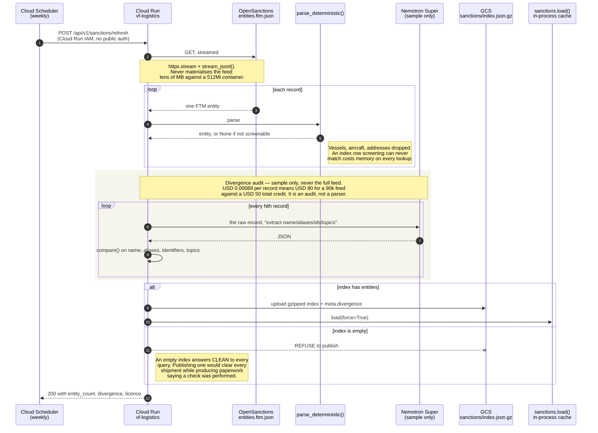
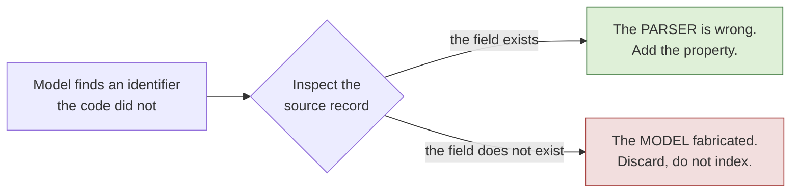
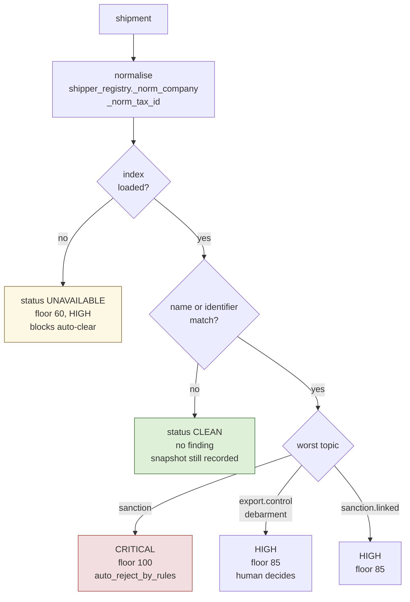

# Flow 1 — Weekly sanctions refresh

Cloud Scheduler wakes a job that rebuilds the sanctions index from OpenSanctions,
publishes it to GCS, and measures a Nemotron Super parse against the deterministic
one on a sample.

## Sequence

## What the divergence audit found

The first run flagged five records where the model produced identifiers the
deterministic parser had not. The obvious reading was fabrication.

Inspecting the records showed the opposite. They were real FTM `innCode` and
`ogrnCode` values, and `IDENTIFIER_PROPS` did not list either — so the parser was
silently dropping every Russian tax and registration number in the feed. An index
with no INNs answers CLEAN to a shipment declaring one, and nothing about that
failure is visible from outside: the index loads, screening runs, no error appears.

A disagreement means inspect the record. It does not mean distrust the model — and
reading it that way would have shipped the bug and reported "the model fabricates
28% of the time", which was false.

Honest figures after the fix, n=25:

| measure | before | after |
|---|---|---|
| identifier agreement | 0.72 | **0.92** |
| records flagged as invented | 5 / 18 | 2 / 25 |
| topic agreement | 1.00 | 1.00 |
| mean alias Jaccard | 0.78 | 0.82 |

Name agreement reads 0.68, and almost all of it is the model choosing a different
*published* variant — `ROMERO SANCHEZ, Antonio` against `Antonio Romero Sanchez`,
Cyrillic against transliterated Latin. Both forms are in the record. It does not
affect screening because every variant is indexed as an alias.

## Where screening runs

`UNAVAILABLE` is a finding, not silence. "We screened and found nothing" and "we
did not screen" are opposite facts, and a system that reports the second as the
first is worse than one with no screening at all — the latter is known to have
none.

Normalisation uses `shipper_registry`'s helpers rather than `verifier._normalize`,
which only lowercases and collapses whitespace. On a sanctions list the near-miss
*is* the technique, and these all have to match:

| declared | matches | via |
|---|---|---|
| `Shell Trading Ltd.` | `Shell Trading Ltd` | punctuation stripped |
| `SHELL TRADING LIMITED` | `Shell Trading Ltd` | legal-form suffix |
| `Shel Trading Ltd` | `Shell Trading Ltd` | filed alias |
| `SheII Trading Ltd` | `Shell Trading Ltd` | homoglyph, capital I for l |
| `Kreshent Marine Services` | `Crescent Marine Services FZE` | transliteration |
| `9999-999-999` | `9999999999` | separators stripped |
