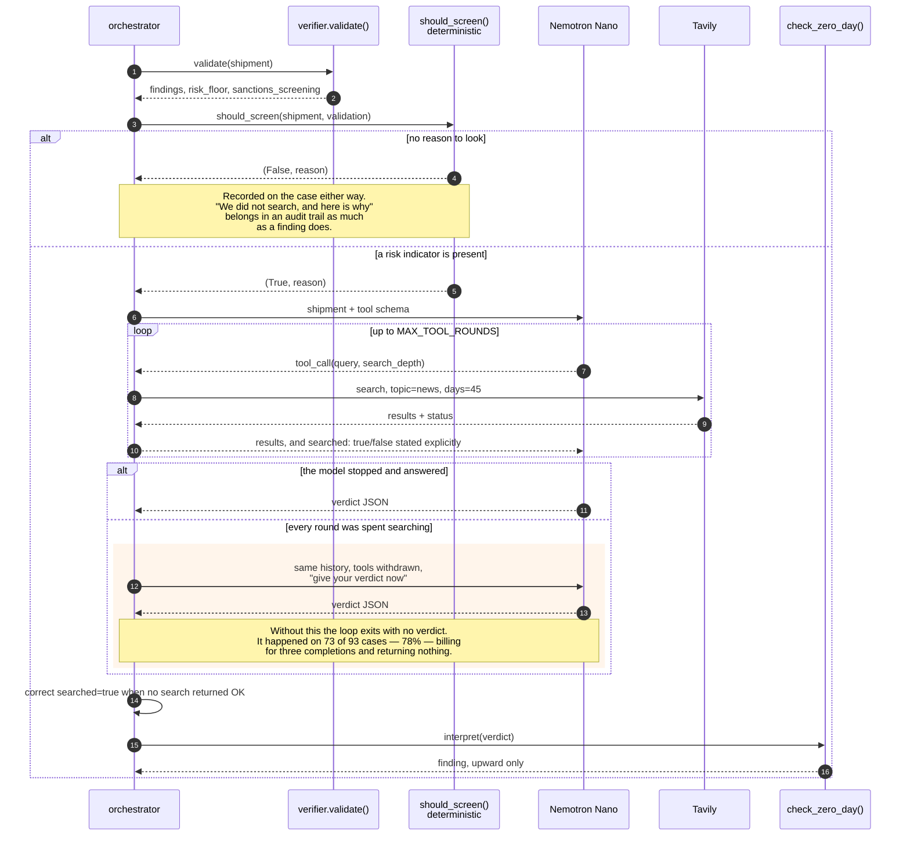
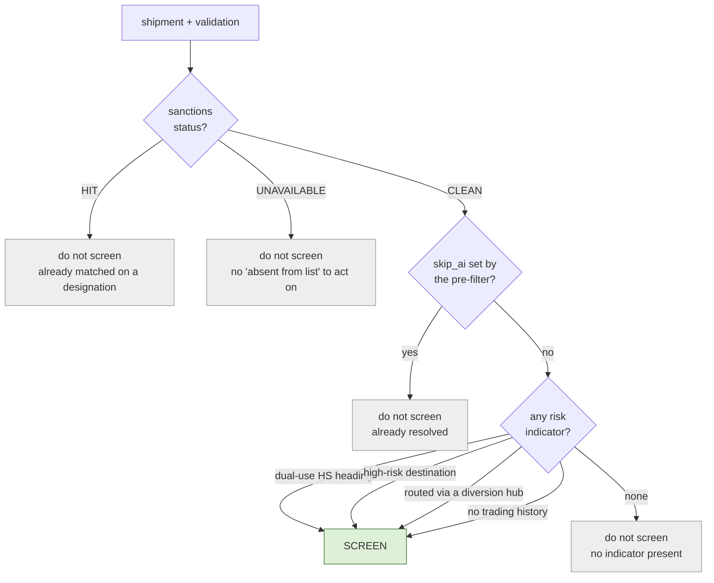
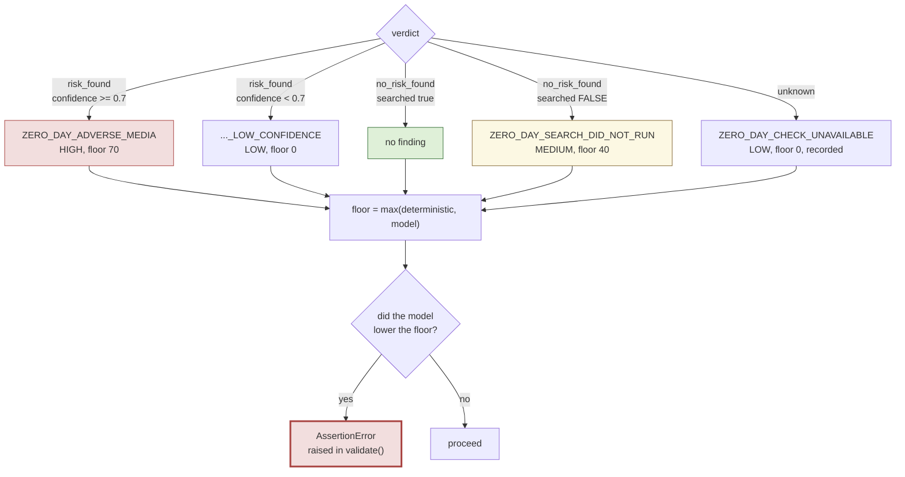
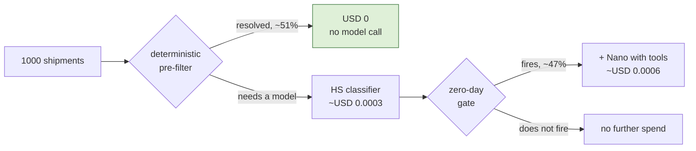

# Flow 2 — Zero-Day Radar

The sanctions index refreshes weekly. A company designated on Tuesday is invisible
to it until the following Sunday, and that window is exactly when a designated
party is most motivated to ship. This flow covers it by searching recent news —
but only when there is a reason to.

## Sequence

## The gate is code, not the model

A model deciding when to spend money has a cost bounded only by its own judgement,
and the budget is USD 50 of inference credit. So the decision to spend is code and
the model's autonomy is over the search *query* and the verdict, which is where
judgement helps.

There is a second reason beyond cost. `compliance_agent.py` fires two Tavily
searches on every single shipment, and an unconditional search on clean traffic
produces a stream of irrelevant results the model then has to reason its way past.
On the HS work the false-positive rate went **up** when the model was given more
material to be cautious about. A search that fires when there is a reason produces
evidence; one that always fires produces noise.

Measured on 200 synthetic cases: the gate fired on 73 attacks and 20 clean cases —
78.5% precision, against 46.5% if it fired on everything.

## Verdict to finding, upward only

Two properties carry the safety argument.

**A `no_risk_found` verdict produces nothing at all.** It cannot clear a shipment
the deterministic checks flagged. So a model that is mistaken, or manipulated by
text inside the cargo description, changes nothing — and `validate()` proves it on
every call by computing the floor twice, with and without the model's findings, and
raising if the second came out lower.

**`searched` is separate from `risk_found`, and both are required.**
`tavily_client` returns an empty list for a missing API key, a timeout, a 429 and a
genuinely empty result. Collapsing those would clear a shipment on a search that
never ran, so a verdict claiming `searched: true` when no search returned `ok` is
corrected in code rather than trusted — it is the one field whose truth the caller
can check.

A news report is also weaker evidence than a government listing, so the floor is 70
rather than the 85 or 100 a `SANCTIONS_MATCH` carries. The number a reviewer sees
should say which kind of evidence drove the case.

## Cost per shipment

Measured end to end: **USD 0.89 per 1,000 shipments**, mean latency 31s, p95 76s.
The latency is the cost of two sequential tool rounds on a 30B model, and it is why
the API offers `?async=true` with a webhook rather than holding the connection.
